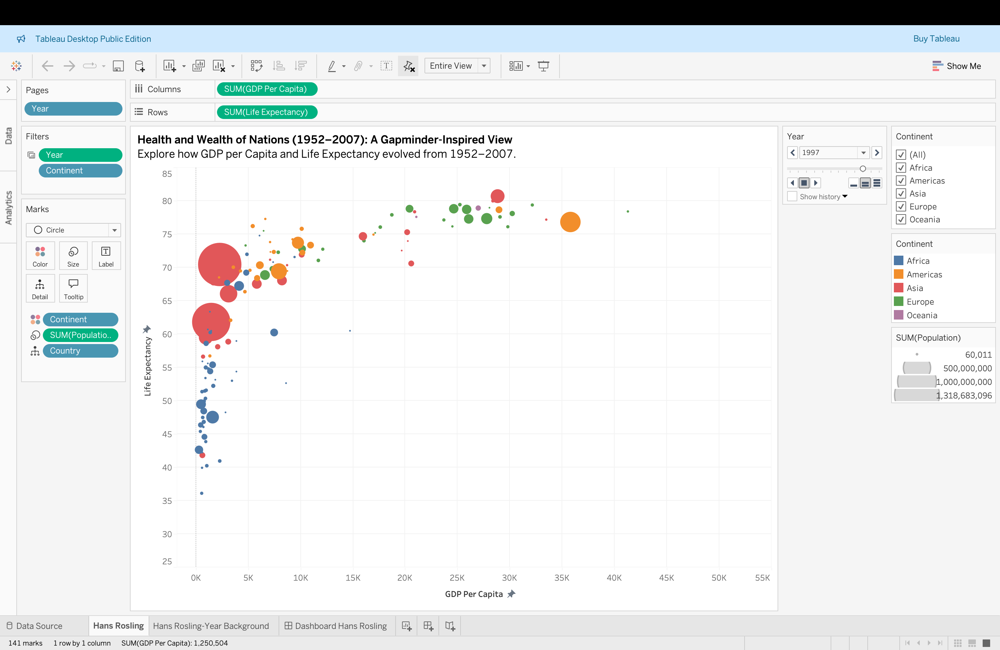
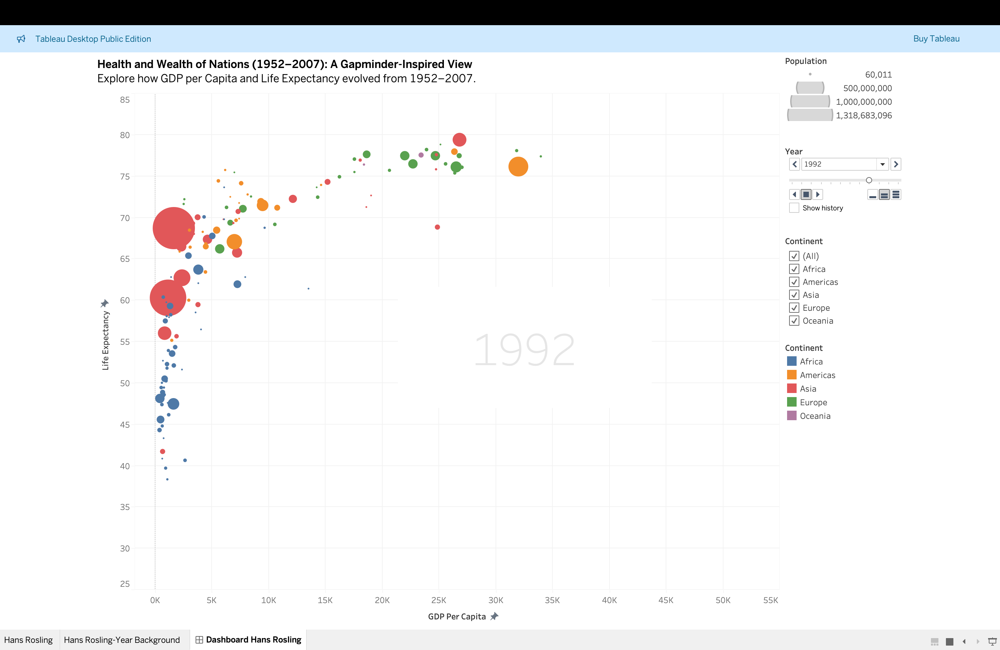

# 🌍 Global Development Trends Analysis (Gapminder)

## 🔍 Overview

This project analyzes global development trends using the Gapminder dataset, focusing on GDP per capita, life expectancy, and population across countries from 1952 to 2007.

Data was cleaned and processed using Python (Pandas, NumPy), and insights were communicated through interactive Tableau visualizations designed for a broad, non-technical audience.

---

## 🧹 Data Cleaning & Preparation

* Used Pandas and NumPy to handle missing and inconsistent values
* Converted and standardized data types for accurate analysis
* Cleaned and structured data for time-series and cross-country comparisons
* Ensured data quality before visualization in Tableau

---

## 📊 Visualization (Tableau)

* Built an animated bubble chart showing GDP per capita vs. life expectancy
* Bubble size represents population; color represents continent
* Year slider enables dynamic analysis over time
* Interactive tooltips provide country-level insights

---

## 📊 Tableau Dashboards

### 🔹 Dashboard View 1

### 🔹 Dashboard View 2

These dashboards visualize how economic and health indicators evolve globally over time, making complex data easy to understand.

---

## 📈 Key Findings

* Countries with higher GDP per capita generally have higher life expectancy
* Developing countries show gradual improvement over time, though at different rates
* Significant disparities exist between regions, highlighting global inequality

---

## 💡 Insights & Impact

* Economic growth is strongly associated with improved health outcomes
* Regional disparities suggest the need for targeted development policies
* Interactive visualization enables clear communication of complex trends to non-technical audiences

---

## 🛠 Tools Used

* Python (Pandas, NumPy) for data cleaning and preprocessing
* Tableau for interactive data visualization

---

## 📎 Files

* `gapminder_data_cleaning.ipynb` – data cleaning and preparation workflow
* Tableau dashboards (see images above)

